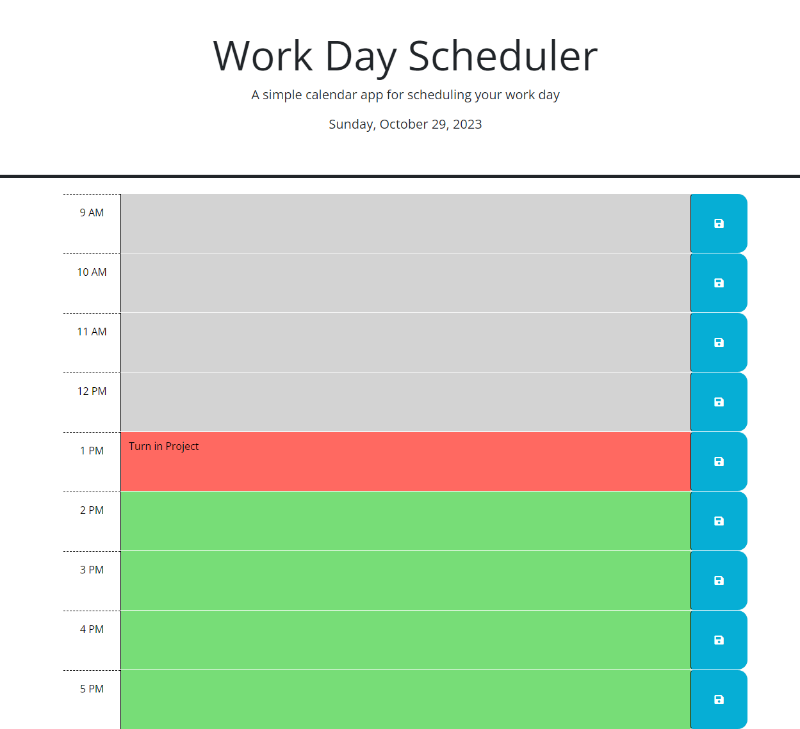
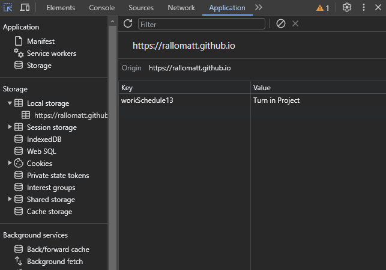

# Work Day Scheduler

## Description
A backend project for my coding bootcamp. The HTML Code as well as the CSS code was given to me already. All the script code was written by me. This backend project uses jQuery and "day.js" third party API's. The website displays the current date towards the top of the page. Then below a schedule of 9 AM to 5 PM is displayed. It is color coded by each hour of day (grey for past, red for present, and green for future). When a user clicks on a input field, then can text what task they want to do for that hour. When the user clicks save, it is saved in local storage. Once it's in local storage when the user comes back to page or refreshes the page, that task will be displayed in that field. 

One thing is note is that when I store in local storage, my keys are the hour corresponding to schedule in military time. 

## Website URL

https://rallomatt.github.io/workDayScheduler/

## Screenshot

Information stored in Local Storage: 

## Credits

HTML code and CSS code was given to me by WASHU coding bootcamp.

## License

Please refer to the LICENSE in the repo.